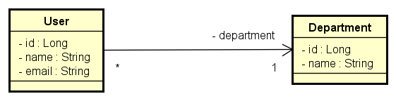

# dio-desafio-explorando-padroes-de-projetos-na-pratica-com-java

## Entendendo o Desafio
O Desafio é criar uma soluçãoque explore os conceitos e padrões já aprendidos na prática usando a linguagem Java. Pode ser criado a partir dos projetos já desenvolvidos nas aulas ou ainda criar algo novo (livre).
Já dominamos o universo do desenvolvimento e construímos uma API REST utilizando o Java 17, a versão LTS mais recente repleta de novidades. Com o poder do Spring Boot 3, otimizamos nossa produtividade graças à sua habilidade de autoconfiguração. Além disso, facilitamos o acesso aos bancos de dados SQL com o auxílio do Spring Data JPA. Também destacamos a importância de uma documentação de API robusta e clara, utilizando o OpenAPI, ou Swagger. E com o Railway, simplificamos o Deploy de nossas soluções na nuvem. Agora, é hora de embarcar em um novo desafio e explorar um domínio de aplicação diferente, mantendo nosso foco em inovar e desenvolver soluções de alto padrão!

# Meu Projeto

## Bem-vindo ao meu projeto!
### Criando o meu primeiro projeto Java com o Springboot. Onde  Utilizei: 
1) Criação de projeto;
2) Modelagem de Domínio;
3) Mapeamento O-R;
4) Banco de Dados;
5) API Rest com Java Spring

### Ferramentas e Plugins Utilizados:
1) Spring Web;
2) Spring data JPA;
3) H2 Data Base
4) Postman
5) Eclipse IDE

### Visão geral do sistema
Vamos construir um pequeno sistema (API REST) de usuários e departamentos, com os seguintes casos de uso:

Buscar todos usuários
Buscar um usuário pelo seu id
Inserir um novo usuário

### Desenvolvimento moderno: relacional -> objeto -> json

